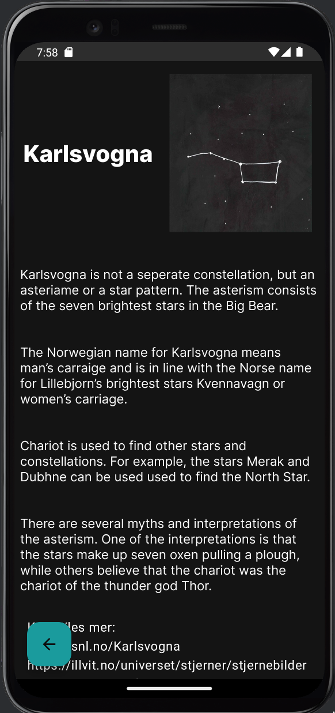

# Cosmogaze

This is the **Cosmogaze** project, a stargazing app that allows users to see the conditions for visible constellations for the upcoming nights. The app gets this information by querying MET APIs with parameters from the user's location, given they provide permissions. Otherwise, users can manually search for locations on the globe screen. The app also has other functionality, such as detailed information about common astronomical objects and updates on upcoming and previous astronomical events.

[To run the app you will need a Google Maps API key](https://developers.google.com/maps/documentation/android-sdk/get-api-key). You then need to provide this API key inside two files: `/project/app/src/main/AndroidManifest.xml` and `/project/app/src/main/java/com/example/cosmogaze/model/dataprocessing/GoogleMaps.kt`.

## Homescreen:

    

This screen shows a summary of the most relevant data for stargazing. If you have given the app location permissions, this will show your location, the time for tonight's sunset for your location, a list of upcoming astronomical events, and a list of constellations with a grading of each constellation's visibility and a short description.

## Globescreen:

    
    

If you have given the app location permissions, upon opening the globescreen you will be presented with detailed descriptions of the night viewing conditions for the upcoming nights. This includes your location, the time of the next sunset for your location, a list of upcoming nights you can see night viewing conditions for, a summary of the night viewing conditions, and a detailed graph showing relevant data for stargazing for the selected night (temperature, cloud coverage, and wind speed).

## Newsscreen:

    

This screen shows upcoming and previous astronomical events.

## Wikiscreen:

    
    

This screen shows information about astronomical objects such as constellations, individual stars, planets & moons, and comets. Each constellation has a personally written description, and the other objects' descriptions are sourced from authoritative references.

Navigation, location parsing, and general theming of the app were all developed as part of this project.

<<<<<<< HEAD
<h2>Team members:</h2>
Herman
Adal
Per Ellef
Dawid
Henriette
=======
>>>>>>> 2ab0286 (cosmogaze)
